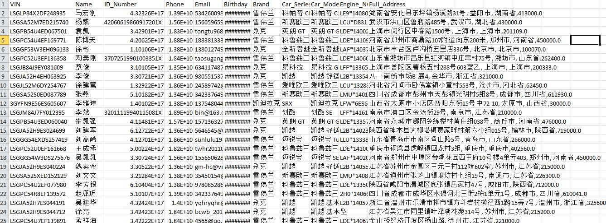

# README: Data Cleaning for CarOwnersNationwide Dataset


## Overview

This project focuses on cleaning a dataset containing car owner information. The dataset includes fields such as VIN, Name, ID Number, Email, and other personal details. The cleaning process involves detecting invalid records, standardizing email addresses, removing duplicates, and handling columns that are unnecessary for analysis. Clean data is saved in one file, while invalid or dropped records are saved in another file for further inspection.

## Files

- **`CarOwnersNationwide.csv`**: The raw dataset containing car owner information with Chinese column names.
- **`merged_cleaned_data.csv`**: The cleaned dataset, which includes only valid records.
- **`merged_garbage_data.csv`**: The garbage dataset, which includes invalid records, dropped columns, and reasons for exclusion.

## Key Features of the Code

### 1. **Column Mapping**
   The code maps the Chinese column names to English for easier handling. The mappings include:
   - `车架号` → `VIN`
   - `姓名` → `Name`
   - `身份证` → `ID_Number`
   - `性别` → `Gender`
   - `手机` → `Phone`
   - `邮箱` → `Email`
   - ... (and more)

### 2. **Email Normalization and Validation**
   - **Normalization**: All email addresses are stripped of spaces and converted to lowercase.
   - **Invalid Emails**: Emails containing phrases like `noemail`, `nomail`, or variations thereof are replaced with `NULL`.
   - **Garbage Handling**: Records with invalid emails are moved to the garbage file unless key fields (VIN, Name, ID_Number, and Full_Address) are present.

### 3. **Consecutive Commas Detection**
   Records with four consecutive commas (indicating missing data) are flagged and moved to the garbage file.

### 4. **Duplicate Detection**
   Duplicates are identified based on combinations of VIN, Email, and ID_Number. All duplicates are moved to the garbage file.

### 5. **Column Merging**
   - The `Province`, `City`, `Address`, and `Postal_Code` fields are merged into a single `Full_Address` field.
   - The individual columns (and other irrelevant ones) are dropped from the cleaned data.

### 6. **Dropped Columns**
   The following columns are removed from the cleaned data and stored in the garbage file for record-keeping:
   - `Postal_Code`, `Province`, `City`, `Address`
   - `Monthly_Salary`, `Marital_Status`, `Education`, `Color`
   - `Gender`, `Industry`, `Configuration`

### 7. **Garbage Reasons**
   Every record in the garbage file is accompanied by a reason for its exclusion:
   - `Invalid Email`: For invalid email addresses.
   - `Consecutive Commas`: For records containing four consecutive commas.
   - `Duplicate Record`: For duplicate entries.
   - `Dropped Column`: For dropped columns.

### 8. **Metrics Calculation**
   - The total number of cleaned rows and garbage rows is calculated.
   - A ratio of clean to garbage rows is displayed to help gauge the data quality.

## Picture of Clean Data

Here’s a sample picture of the clean data after the cleaning process is complete:


## Installation and Setup

### Prerequisites

- Python 3.x
- `pandas`
- `numpy`
- `os`
- `warnings`

### How to Run

1. **Clone or download** the project repository to your local machine.
2. Install required libraries by running the following command:

   ```bash
   pip install pandas numpy
   ```

3. **Place your dataset** (`CarOwnersNationwide.csv`) in the specified directory (`C:/Users/aaack/OneDrive/Desktop/ProtexxaAI/DataCleaning/`).
4. Run the script, and the cleaned and garbage data will be saved as `merged_cleaned_data.csv` and `merged_garbage_data.csv`.

### Sample Output

After running the code, you will see output like this:

```
Total cleaned rows: 8000
Total garbage rows (excluding dropped columns): 2000
Ratio of clean rows to garbage rows: 4.00
Merged cleaned and garbage files saved successfully.
```

## Code Structure

- **Loading Data**: The dataset is loaded using `pandas` with low memory handling for large files.
- **Column Renaming**: Chinese column names are mapped to English equivalents for easier processing.
- **Email Cleaning**: Emails are normalized and validated for correctness.
- **Invalid Records Handling**: Records with missing key fields or invalid data (like consecutive commas) are flagged and moved to the garbage file.
- **Duplicate Removal**: Duplicate records based on VIN, Email, and ID_Number are removed.
- **Garbage File**: Invalid records are saved in a separate file with reasons for exclusion.
- **Cleaned Data**: Valid data is saved in a cleaned file for further use.

## Future Improvements

- Additional validation can be implemented for other fields like phone numbers and addresses.
- Support for other datasets with different structures.
- Optimization of the cleaning process for large-scale data.

## Credits
- Asha Cumberbatch
