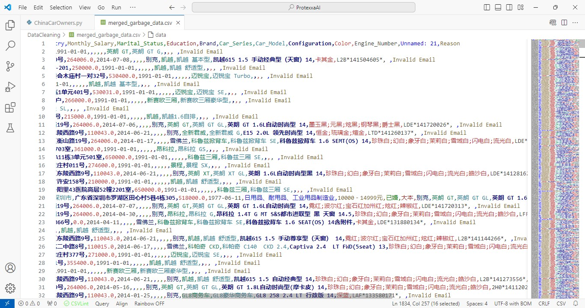

# Data Cleaning and Processing Script for Car Owner Dataset


## Overview

This Python script performs data cleaning on a dataset of car owners in China, originally formatted in Chinese. The script reads the data from a CSV file, translates the column headers to English, and cleans the data by removing invalid records, handling duplicates, and merging relevant address information. The cleaned data and garbage records are then saved to separate CSV files.

## Features

- **Column Translation**: Automatically translates column names from Chinese to English for easier comprehension.
- **Email Normalization**: Strips whitespace and converts email addresses to lowercase to ensure consistency.
- **Invalid Email Handling**: Identifies and replaces invalid email formats with 'NULL'.
- **Consecutive Comma Detection**: Detects rows containing four consecutive commas and marks them for exclusion.
- **Duplicate Record Identification**: Flags duplicates based on VIN, Email, and ID_Number, ensuring unique records.
- **Address Merging**: Combines individual address fields (Address, City, Province, Postal_Code) into a single `Full_Address` column for better usability.
- **Customizable Column Dropping**: Allows for the removal of specified columns after cleaning to streamline the dataset.
- **Retention of Valid Invalid Emails**: Retains rows with invalid emails if all required fields are present.
- **Output Generation**: Produces two separate CSV files—one for cleaned data and another for garbage records—along with a summary of the cleaning process.

## Requirements

- Python 3.x
- pandas
- numpy

You can install the required libraries using pip:

```bash
pip install pandas numpy
```

## File Structure

- `CarOwnersNationwide.csv`: The input CSV file containing car owners' data in Chinese.
- `merged_cleaned_data.csv`: The output CSV file containing the cleaned data.
- `merged_garbage_data.csv`: The output CSV file containing records identified as garbage.

## How to Use

1. Ensure the input CSV file (`CarOwnersNationwide.csv`) is located at the specified file path:
   ```python
   file_path = 'C:/Users/aaack/OneDrive/Desktop/ProtexxaAI/DataCleaning/CarOwnersNationwide.csv'
   ```

2. Run the script. It will read the data, perform cleaning operations, and generate two output files:
   - `merged_cleaned_data.csv`: Contains valid records with unnecessary fields removed.
   - `merged_garbage_data.csv`: Contains invalid records with reasons for exclusion.

3. The script will print the total number of cleaned rows, total garbage rows, and the ratio of clean rows to garbage rows to the console.

## Data Cleaning Process

The script performs the following operations:

1. **Load Data**: The dataset is loaded using `pandas` with `low_memory=False` to prevent DtypeWarnings.

2. **Rename Columns**: The columns are renamed from Chinese to English based on a predefined mapping.

3. **Email Normalization**: Email addresses are normalized by stripping spaces and converting them to lowercase.

4. **Invalid Email Handling**: Emails containing specific patterns are replaced with 'NULL', and rows with invalid emails are marked for removal.

5. **Consecutive Commas**: Rows with four consecutive commas are identified as garbage records.

6. **Duplicate Records**: Duplicates based on VIN, Email, and ID_Number are identified and marked.

7. **Address Merging**: Address-related fields (Address, City, Province, Postal_Code) are combined into a single `Full_Address` column.

8. **Drop Unnecessary Columns**: Specified columns are removed from the cleaned dataset.

9. **Invalid Email Retention**: Rows with invalid emails are kept if they contain all required fields.

10. **Save Outputs**: The cleaned data and garbage data are saved as separate CSV files.

## Garbage Records Overview

### Example Garbage Records
 .jpg)


The above image shows a sample of the records identified as garbage, along with reasons for their exclusion:

- **Invalid Email Format**: Records where email addresses did not conform to standard email formats were marked as garbage. For instance, entries like "user@noemail.com" or emails missing the '@' symbol are excluded.
  
- **Consecutive Commas**: Rows containing four or more consecutive commas (indicating missing or incomplete data) are flagged for removal.
  
- **Duplicate Entries**: Records identified as duplicates based on VIN, Email, and ID_Number are included in the garbage dataset to ensure the uniqueness of cleaned data.

## Output

The script generates two CSV files:
- `merged_cleaned_data.csv`: Contains valid records.
- `merged_garbage_data.csv`: Contains invalid records with a reason for exclusion.

## Conclusion

This script provides a comprehensive approach to cleaning a dataset of car owners by handling missing values, invalid records, and duplicates. The output files can be used for further analysis or processing. 

- Modify the email validation logic or other data cleaning operations as necessary.

## Credits
- Asha Cumberbatch
